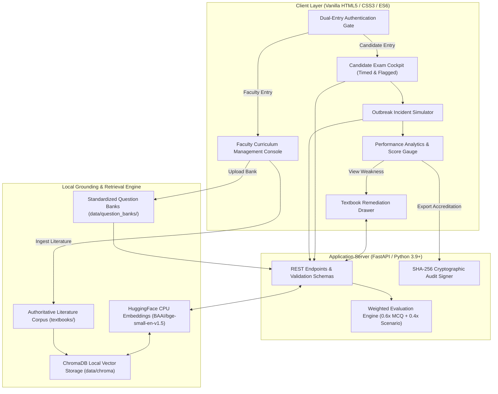

# Public Health Competency Assessment & Learning Platform
### *Institutional CEPH / CPH Standardized Examination, Incident Simulation & Remediation System*

---

## 1. Executive Summary & Problem Statement Alignment

The **Public Health Competency Assessment & Learning Platform** is an enterprise-grade, local-first assessment system developed to prepare candidates and evaluate practitioners across the foundational pillars established by the **Council on Education for Public Health (CEPH)** and the **National Board of Public Health Examiners (CPH)** standards.

```
┌──────────────────────────────────────────────────────────────────────────────┐
│                        CORE CEPH / CPH PILLARS EVALUATED                     │
├──────────────────────┬───────────────────────┬───────────────────────────────┤
│ 1. Epidemiology      │ 2. Biostatistics      │ 3. Research Methods           │
│ 4. Environmental H.  │ 5. Program Management │ 6. Professional Communication │
└──────────────────────┴───────────────────────┴───────────────────────────────┘
```

### Direct Alignment with Institutional Requirements:
| Client Requirement | Platform Implementation & Architecture |
| :--- | :--- |
| **Standardized Board Exam** | Single-item examination cockpit, 15-minute countdown clock, responsive item matrix, and review flag controls. |
| **Incident Command Simulation** | Branching multi-stage emergency response scenario with immediate consequence feedback and score deltas. |
| **Local-First Privacy & Cost** | 100% offline, zero cloud API fees, CPU-based embeddings (`BAAI/bge-small-en-v1.5`), and local ChromaDB persistence. |
| **Grounding & Remediation** | Slide-over remediation drawer with textbook excerpts, chunk similarity scores, and targeted study directives. |
| **Accreditation Export** | Authoritative transcript generator featuring cryptographically signed SHA-256 validation audit hashes. |
| **Curriculum Extensibility** | Administrative console supporting dynamic drag-and-drop ingestion of textbooks (`.txt`, `.md`, `.pdf`) and question banks (`.json`). |

---

## 2. System Architecture



---

## 3. Key Capabilities & Functional Modules

### A. Dual-Entry Portal with Strict Role Separation
- **Candidate Assessment Portal**: Full name, student ID, and honor code certification. Unlocks the exam cockpit and countdown timer while strictly hiding administrative tools.
- **Faculty / Institutional Console**: Passkey-secured portal (`admin123`). Grants full access to system telemetry, document ingestion pipelines, and non-scoring test-run preview mode.

### B. Single-Item Board Examination Cockpit
- **Standardized Presentation**: High-contrast daylight clinical palette, letter-badged option cards (`A`, `B`, `C`, `D`), and keyboard shortcuts (`1-4` / `A-D`).
- **Matrix Navigator**: Quick-jump item palette with answered state indicators and real-time review flags.
- **Timed Session**: 15-minute countdown clock with warning thresholds and automated submission triggers.

### C. Multi-Stage Outbreak & Environmental Incident Simulation
- **Incident Command Scenarios**: Realistic epidemiological dilemmas (e.g., *Metropolitan Salmonellosis Outbreak*, *Municipal Water Supply TCE Contamination*).
- **Branching Stages**: Sequential choices impacting public health outcomes, accompanied by consequence feedback and real-time score adjustments.

### D. Objective Scoring Engine & Analytics
- **Readiness Formula**: 
  $$\text{Overall Readiness Score} = (0.60 \times \text{MCQ Accuracy}) + (0.40 \times \text{Scenario Score})$$
- **Visual Analytics**: Interactive SVG competency readiness gauge, domain-by-domain proficiency progress bars, and prioritized remediation lists.

### E. Local-First Textbook Remediation Pipeline
- **Local CPU Retrieval**: Fast, deterministic semantic search across authoritative literature without external network requests or tokens.
- **Structured Study Directives**: Delivers excerpted textbook passages, source citations, and direct access to synthesized practice questions.

### F. Cryptographic Institutional Accreditation Transcripts
- **Audit Verification**: Every transcript generates a deterministic SHA-256 audit hash derived from session ID, completion timestamp, and score parameters.
- **Print & PDF Ready**: Clean styling for institutional archival and CEPH/CPH portfolio submission.

---

## 4. Quick-Start Guide

### Option 1: 1-Click Launch (Windows)
Double-click `run_platform.bat` in the project root. The script will automatically:
1. Verify Python 3.9+ installation.
2. Activate existing virtual environments if present.
3. Install/verify packages from `requirements.txt`.
4. Launch the FastAPI server at `http://localhost:8000`.
5. Automatically open the assessment platform in your default browser.

### Option 2: Manual Launch (Windows / macOS / Linux)

```bash
# 1. Clone or navigate to the project directory
cd PublicHealth-Platform

# 2. Create and activate a virtual environment (optional but recommended)
python -m venv venv
# On Windows:
venv\Scripts\activate
# On macOS/Linux:
source venv/bin/activate

# 3. Install dependencies
pip install -r requirements.txt

# 4. Ingest baseline curriculum textbooks into ChromaDB (if not already indexed)
python src/ingest.py

# 5. Start the backend API & static frontend server
uvicorn backend.main:app --host 0.0.0.0 --port 8000 --reload
```

Once running, access the portal at **`http://localhost:8000`**.

---

## 5. Faculty & Administrator Guide

### Accessing the Administrative Console
1. At the login gate, switch to the **Faculty / Administrator** tab.
2. Enter the administrator passkey: `admin123`.
3. The dashboard reveals live system telemetry, including indexed chunks and question bank totals.

### Uploading New Reference Guidelines & Textbooks
- In the **Knowledge Retrieval Pipeline** panel, drag and drop any `.txt`, `.md`, or `.pdf` document (e.g., CDC guidelines, WHO epidemic manuals, environmental toxicology reports).
- The system automatically chunks the text, computes local HuggingFace embeddings, and indexes the passages into ChromaDB.

### Importing New Question Banks
- In the **Question Bank Ingestion Pipeline** panel, upload a validated JSON question bank (such as `data/question_banks/expanded_sample_dataset.json`).
- The backend validates adherence to the `QuestionBank` schema and updates the live examination questions instantly without requiring a server restart.

---

## 6. Repository Layout

```
PublicHealth-Platform/
├── backend/
│   ├── __init__.py
│   └── main.py                 # FastAPI REST API, schemas, evaluation & admin endpoints
├── frontend/
│   ├── index.html              # Single-page institutional web interface
│   ├── style.css               # Clinical CSS design system & responsive styling
│   └── app.js                  # Frontend application state, exam flow & API connectors
├── src/
│   ├── __init__.py
│   ├── ingest.py               # Document ingestion & vector store builder
│   └── rag_engine.py           # ChromaDB vector retrieval & citation search
├── data/
│   ├── chroma/                 # Persistent ChromaDB vector database
│   └── question_banks/
│       ├── core_competencies.json      # Primary CEPH/CPH 6-domain question bank
│       └── expanded_sample_dataset.json # Extensible sample dataset & TCE scenario
├── textbooks/                  # Authoritative public health reference literature
├── run_platform.bat            # 1-Click Windows startup script
├── requirements.txt            # Python dependencies
└── README.md                   # Technical documentation
```

---

## 7. REST API Reference

| Method | Endpoint | Description |
| :--- | :--- | :--- |
| `GET` | `/api/health` | Service health status, bank metrics, and ChromaDB vector store statistics. |
| `GET` | `/api/competencies` | List all 6 core public health competency domains. |
| `GET` | `/api/questions` | Retrieve sanitized examination questions (answer keys masked). |
| `GET` | `/api/scenarios` | Retrieve sanitized multi-stage Incident Command scenarios. |
| `POST` | `/api/evaluate` | Grade complete session and calculate weighted readiness score. |
| `POST` | `/api/remediation` | Retrieve grounded textbook excerpts for a specific pillar via RAG. |
| `POST` | `/api/export-report` | Generate institutional transcript with SHA-256 cryptographic audit signature. |
| `POST` | `/api/admin/upload-curriculum` | Ingest and index reference documents (`.txt`, `.md`, `.pdf`). |
| `POST` | `/api/admin/upload-questions` | Validate and hot-reload JSON question banks. |

---

## 8. License & Accreditation Standards
Developed in compliance with foundational competencies specified by the **Council on Education for Public Health (CEPH)** and the **National Board of Public Health Examiners (NBPHE / CPH)**. Designed for academic and institutional training environments.
